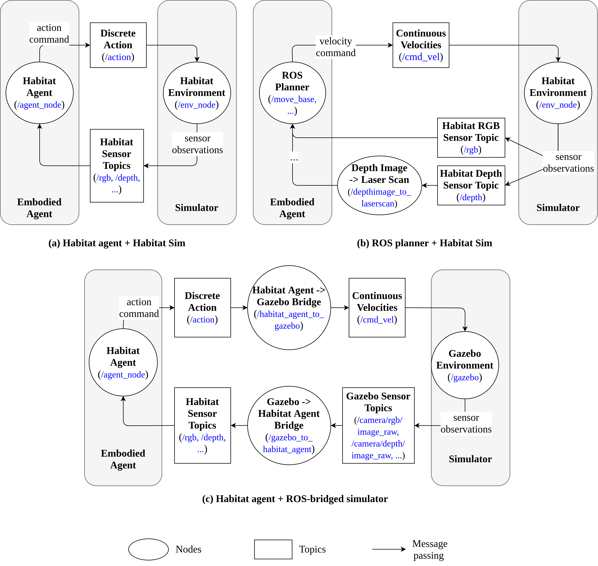

ros_x_habitat
==============================

A ROS package to bridge [AI Habitat](https://aihabitat.org/) with the ROS ecosystem.

## Outline
   1. [Motivation](#motivation)
   1. [Installation](#installation)
   1. [System Architecture](#architecture)
   1. [Examples](#examples)
   1. [Cite Our Work](#cite-our-work)
   1. [License](#license)
   1. [Acknowledgments](#acknowledgments)
   1. [References](#references-and-citation)

## Motivation
The package allows roboticists to
   * Navigate an AI Habitat agent within photorealistic scenes simulated by Habitat Sim through ROS;
   * Connecting a ROS-based planner with Habitat Sim;
   * Connecting an AI Habitat agent with a ROS-bridged simulator ([Gazebo](http://gazebosim.org/) for example) through ROS.
   * Leverage Habitat Sim's photorealistic and physically-realistic simulation capability through ROS.

## Installation
1. Install Ubuntu 20.04 + ROS Noetic.
2. Install [Anaconda](https://www.anaconda.com/). 
3. Install [Habitat Sim](https://github.com/facebookresearch/habitat-sim) following the official instructions. Note that
    * We suggest you to use the version tagged `0.2.0`. Any versions below this is not supported;
    * We also suggest install by building from the source;
    * Install with Bullet Physics;
    * If you have an NVIDIA card, we suggest you to install with CUDA.
4. Install [Habitat Lab](https://github.com/facebookresearch/habitat-lab) in the same conda environment following the official instructions. Note that
    * We suggest you to use the version tagged `0.2.0`. Any versions below this is not supported;
    * In addition to the core of Habitat Lab, also install `habitat_baselines` and other required packages.
5. Install the following ROS packages:
   * `ros-noetic-depthimage-to-laserscan`
   * `ros-noetic-laser-scan-matcher`
   * `ros-noetic-rtabmap-ros`
   * `ros-noetic-joy`
6. Clone the repo to your catkin workspace.
7. Compile the package by calling `catkin_make`.
8. Export the repo's directory to `$PYTHONPATH`:
   ```
   export PYTHONPATH=$PYTHONPATH:<path-to-the-root-directory-of-the-repo>
   ```

## System Architecture
``ros_x_habitat`` exists as a collection of ROS nodes, topics and services. For simplicity, we have omitted components not essential to the interface's operation:



## Examples
Coming soon

## Cite Our Work
If you are interested in using ``ros_x_habitat`` for your own research, please cite [our (Arxiv preprint) paper](https://arxiv.org/abs/2109.07703):
```
@misc{chen2021rosxhabitat,
      title={ROS-X-Habitat: Bridging the ROS Ecosystem with Embodied AI}, 
      author={Guanxiong Chen and Haoyu Yang and Ian M. Mitchell},
      year={2021},
      eprint={2109.07703},
      archivePrefix={arXiv},
      primaryClass={cs.RO}
}
```

## License
This work is under the [Creative Commons](https://creativecommons.org/licenses/by/4.0/) CC BY 4.0 License.

## Acknowledgments
We would like to thank [Bruce Cui](https://github.com/brucecui97) from the Department of Mechanical Engineering at UBC for his initial work on ``ros_x_habitat``. Also,  we would like to appreciate the AI Habitat team from Facebook AI Research, including Prof. Dhruv Batra, Alex Clegg, Prof. Manolis Savva, and Erik Wijmans for their generous support throughout our development process.

## References
1. [Habitat: A Platform for Embodied AI Research.](https://arxiv.org/abs/1904.01201) Manolis Savva, Abhishek Kadian, Oleksandr Maksymets, Yili Zhao, Erik Wijmans, Bhavana Jain, Julian Straub, Jia Liu, Vladlen Koltun, Jitendra Malik, Devi Parikh, Dhruv Batra. IEEE/CVF International Conference on Computer Vision (ICCV), 2019.
2. [Habitat 2.0: Training Home Assistants to Rearrange their Habitat.](https://arxiv.org/abs/2106.14405) Andrew Szot, Alex Clegg, Eric Undersander, Erik Wijmans, Yili Zhao, John Turner, Noah Maestre, Mustafa Mukadam, Devendra Chaplot, Oleksandr Maksymets, Aaron Gokaslan, Vladimir Vondrus, Sameer Dharur, Franziska Meier, Wojciech Galuba, Angel Chang, Zsolt Kira, Vladlen Koltun, Jitendra Malik, Manolis Savva, Dhruv Batra. arXiv preprint arXiv:2106.14405, 2021.
3. [ROS-X-Habitat: Bridging the ROS Ecosystem with Embodied AI.](https://arxiv.org/abs/2109.07703) Guanxiong Chen, Haoyu Yang, Ian Mitchell. arXiv preprint arXiv:2109.07703, 2021.